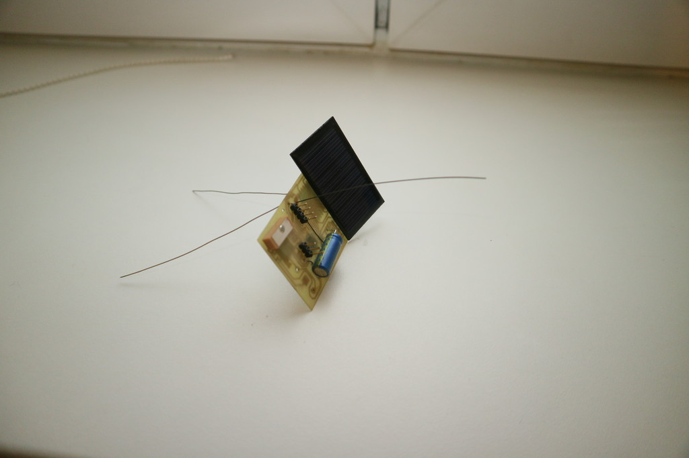
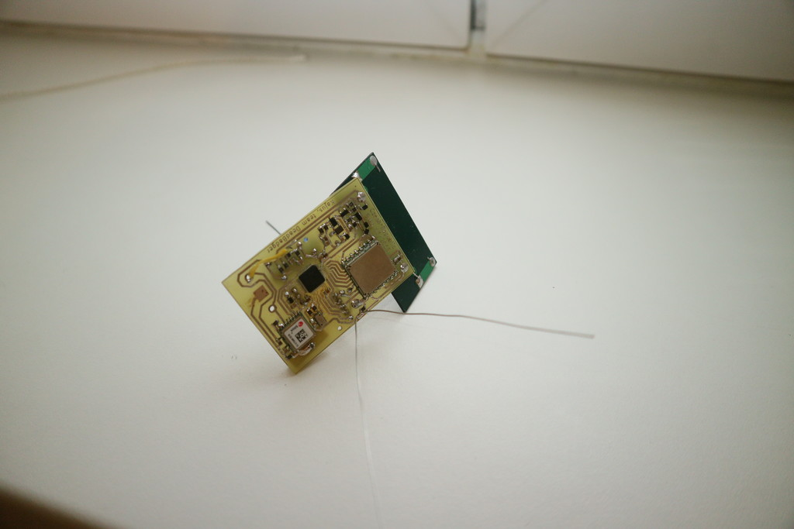

Picoballoon challange 2019, team deadbadger probe
-------------------------------------------------

This repo contains source codes and hw design of the picoballoon probe designed
for https://www.hvezdarna.cz/?p=7694.

Due to the lack of free time, the pcb is very suboptimal as I needed single sided
board with wider traces for diy manufacturing process (made it few days before the
launch, didn't have enough time to send it to a pcb house).

The circuit contains:
- MCU stm32f070
- GPS u-blox max-m8
- Lora module HPD13
- Analog thermometer
- Digital pressure sensor MS5607 (failed to make it working before start - getting nack all the time)
- Solar panel that charges the supercap (wanted bare cells from china, but delivery time was too long, used one quite heavy panel from my junk box)
- 3.3 V boost switching power supply with startup circuit (starts around 2,5 V)

The software is quite simplified too. The Lmic library takes care of the LoRa
communications. Minmea handles processing nmea messages from gps. For future
reference, the libopencm3 is not the best option when dealing with stm32f0
family, I've had serious issues with rtc wakeup timer and failed
to wake up from deep sleep on rtc events anyway...

The code does following:
- Initialize peripherals
- Send LoRa join request
- Try to get the gps position
- After gps fix or timeout, send data over the LoRa connection and shutdown

Sending period depends on amount of sunlight (solar cell current) and supercap
capacity.

